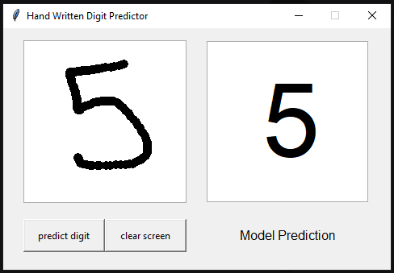

# Handwritten Digit Predictor

This Python application allows users to draw a digit on a canvas and predicts the digit using a pre-trained model based on the MNIST dataset. The GUI is built using Tkinter, and the prediction is performed using a TensorFlow model that has been saved and loaded via Pickle.



## Features

- **Canvas for Drawing:** Draw digits (0-9) on the canvas using your mouse.
- **Digit Prediction:** Once a digit is drawn, click on the "predict digit" button to see the model's prediction.
- **Clear Canvas:** Use the "clear screen" button to erase the canvas and draw a new digit.
- **Model Integration:** The application uses a pre-trained TensorFlow model to recognize handwritten digits.

## Requirements

To run this project, you need to have the following dependencies installed:

- Python 3.x
- [TensorFlow](https://www.tensorflow.org/) (For the ML model)
- [Numpy](https://numpy.org/) (For array manipulations)
- [Pillow (PIL)](https://python-pillow.org/) (For image processing)
- [Tkinter](https://wiki.python.org/moin/TkInter) (For GUI)
- [Pickle](https://docs.python.org/3/library/pickle.html) (For loading the pre-trained model)

## Installation

1. **Clone the Repository:**

   ```bash
   git clone https://github.com/ansariafzal-ka/Hand-Written-Digit-Prediction.git
   cd Hand-Written-Digit-Prediction

   ```

2. **Install Dependencies:**

   - Create the virtual environment:

     ```bash
     python -m venv venv

     ```

   - Activate the virtual environment:

     ```bash
     ./venv/Scripts/activate
     ```

   - You can install the required dependencies with:

     ```bash
     pip install -r requirements.txt
     ```

3. **Run the Application:**

   To start the application, run the following command in your terminal:

   ```bash
   py main.py
   ```
